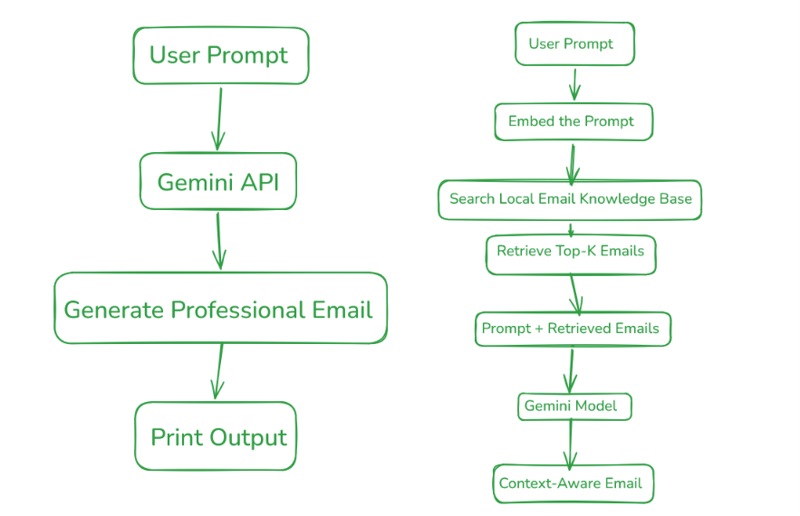

Example input :
Write an email requesting leave for 3 days due to fever.

Example Output:

Subject: Leave Request for Three Days Due to Illness

Dear Sir,

I hope you are doing well.

I am writing to request a leave of absence for three days as I am suffering from a fever and have been advised by my doctor to take adequate rest.

I kindly request you to approve my leave from 15th July to 17th July. I will ensure that all pending work is completed upon my return.

Thank you for your understanding.

Sincerely,

Your Name
